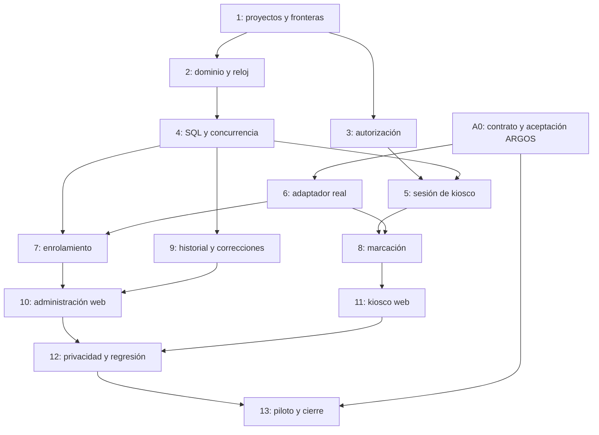

# Control de acceso — plan de la fase 1

Fecha: 2026-09-25. Estado: plan preparado, **ninguna tarea implementada**.
El usuario limita esta sesión a brainstorming, spec y plan. Este documento
no autoriza ejecutar las tareas ni desplegar.

Leer [brainstorming](../specs/2026-09-25-control-acceso-fase1-brainstorm.md) y
[spec](../specs/2026-09-25-control-acceso-fase1-design.md). Las decisiones
funcionales aprobadas están distinguidas de las propuestas técnicas y de las
dependencias externas pendientes.

## Reglas para el futuro ejecutor

- Trabajar en develop según AGENTS.md; preservar cambios ajenos. En el momento
  de escribir existen dos modificaciones ajenas en los tests de observabilidad:
  `CorrelacionExtremoAExtremoTests.cs` y `HostsObservabilidadFixture.cs`.
- Rutas de este plan relativas a Trajano-Icarus salvo A0 (repositorio hermano).
  Leer instrucciones locales antes de modificar cada árbol.
- Cada tarea lleva pruebas dirigidas que deben verse fallar por la causa
  descrita antes de implementar. No marcar una tarea completada por compilar.
- **Antes de cada commit y push de código**, `./verify.ps1` completo, con Docker
  disponible. Los comandos dirigidos siguientes son el ciclo TDD, no sustituyen
  la puerta. No usar excepciones de planes históricos ni `--no-verify`.
- Para commits solo documentales: gates de mojibake, enlaces y diff sin errores.
- .NET 10, versiones centrales de `Icarus/Directory.Packages.props`, EF Core,
  MediatR, xUnit/NSubstitute y Testcontainers existentes. React/MUI/Vitest según
  `web/AGENTS.md`; no introducir otra librería de UI.
- Todos los escenarios usan datos sintéticos. Los ensayos biométricos reales
  del piloto no se almacenan en git ni se vuelcan a logs.
- Cada tarea termina con revisión del diff propio y commit solo de sus rutas.
  Los mensajes previstos abajo son orientativos; nunca incluyen datos privados.

## Dependencias y puntos de decisión



Las tareas 1–5 y 9 no requieren ARGOS real. Tareas 7–8 y UI pueden desarrollarse
contra dobles del contrato una vez fijado A0, pero no completarse como flujo
productivo hasta superar 6 y 13. Si A0 requiere vídeo/gestos en vez de captura
pasiva, actualizar spec y tareas 6, 7 y 11 antes de implementar esas partes.
No seleccionar en silencio un modelo, licencia, umbral o almacenamiento facial.

## A0 — Dependencia externa: contrato ARGOS v2

Responsable futuro: ejecutor de ARGOS, coordinado con agenteLocal y agenteVPS.
No se inicia ese trabajo desde esta sesión. ARGOS tiene su propio AGENTS.md:
PR hacia su rama permanente develop, pruebas e imagen Docker antes de integrar,
despliegue de producción únicamente manual y autorizado.

Rutas a revisar allí: `ARGOS/views.py`, `ARGOS/api_client.py`,
`ARGOS/decorators.py`, `ARGOS/logger.py`, `requirements.txt`, `Dockerfile` y
`tests/test_workflows.py`. Proponer `docs/control-acceso-v2.md`,
`ARGOS/control_acceso_v2.py` y `tests/test_control_acceso_v2.py` en su propio
plan, después de decidir custodia/PAD; no tratar estas rutas nuevas como código
que ya existe.

- [ ] Confirmar con agenteVPS versión de imagen/commit y capacidades realmente
  desplegadas; la respuesta 48 solo acredita relojes.
- [ ] Fijar contrato de namespace/tenant opacos, perfiles versionados,
  operaciones idempotentes, identificación, revocación y capacidades.
- [ ] Decidir modelo PAD/versión/licencia, formato de evidencia y criterios
  medibles de identificación, ambigüedad, rechazo y rendimiento con el equipo.
- [ ] Definir almacén cifrado, claves, respaldo/restauración, eliminación y
  aislamiento; no usar el almacén biométrico del legacy como dependencia oculta.
- [ ] Prueba roja: contrato v2 ausente, rechazo de GUID/tenant ajeno, falta de
  PAD y filtración de candidatos detectados por tests nuevos.
- [ ] Verificación prevista en ARGOS: `python -m pytest tests/test_control_acceso_v2.py`,
  suite completa del repositorio y `docker build -t argos:control-acceso-validacion .`.
  Confirmar primero el runner vigente; no dar estos comandos por ejecutados.
- [ ] Preservar `/api/verify` y sus contratos existentes; ensayar restauración y
  borrado de un perfil sintético. Tests de integración no prueban precisión PAD.
- [ ] Entregar contrato firmado por versión y matriz de ensayos, sin biometría
  ni secretos en el repositorio de Trajano-Icarus.

Commit documental de salida previsto aquí: `docs(control-acceso): fija contrato ARGOS v2`.
Hasta ese resultado, el adaptador real está condicionado, no implementable por
suposición.

## 1 — Proyectos, composición y fronteras

Crear los `.csproj` bajo:

- `Icarus/src/ControlAcceso/Icarus.ControlAcceso.Domain/`
- `Icarus/src/ControlAcceso/Icarus.ControlAcceso.Application/`
- `Icarus/src/ControlAcceso/Icarus.ControlAcceso.Infrastructure/`

Modificar `Icarus/Icarus.sln`, `Icarus/src/Host/Icarus.Host/Icarus.Host.csproj`
y los `.csproj` de `Icarus.UnitTests`, `Icarus.IntegrationTests` y
`Icarus.ArchitectureTests`. Extender
`Icarus/tests/Icarus.ArchitectureTests/ReglasDeCapasTests.cs` y
`Icarus/tests/Icarus.ArchitectureTests/ReglasDeModulosTests.cs`.

- [ ] Rojo: prueba de cobertura detecta módulo ausente; reglas prohíben
  referencias a Clientes/Identity y EF/HTTP dentro del dominio.
- [ ] Crear proyectos, referencias mínimas, registro de ensamblados y unidad
  de trabajo propia; no crear tablas o funcionalidades de fases 2–4.
- [ ] Dirigido: `dotnet test Icarus/tests/Icarus.ArchitectureTests/Icarus.ArchitectureTests.csproj`.
- [ ] Puerta y commit: `feat(control-acceso): crea fronteras del módulo`.

## 2 — Dominio diario, reloj y revisiones

Crear en `Icarus/src/ControlAcceso/Icarus.ControlAcceso.Domain/`:
`ConfiguracionAccesoTrabajador.cs`, `JornadaAcceso.cs`, `Marcacion.cs`,
`RevisionJornada.cs`, `IntervaloAcceso.cs` y `TipoMarcacion.cs`.
En `Icarus.ControlAcceso.Application/Tiempo/`, crear `IRelojAcceso.cs`;
en `Icarus.ControlAcceso.Infrastructure/Tiempo/`, `RelojBolivia.cs` usando
TimeProvider. Crear pruebas en
`Icarus/tests/Icarus.UnitTests/ControlAcceso/JornadaAccesoTests.cs`,
`CorreccionJornadaTests.cs` y `RelojBoliviaTests.cs`.

- [ ] Rojo: Salida inicial aceptada, evento al día equivocado, corrección que
  borra original, intervalo solapado y bloqueo indebido por ayer incompleto.
- [ ] Implementar alternancia, estado derivado Abierta/Completa/Incompleta,
  revisión efectiva y originales inmutables. Pasar reloj/instante como entradas
  comprobables; sin `DateTime.Now` en dominio.
- [ ] Cubrir pares 08:00–12:00/13:00–17:00, cancelación, medianoche BO,
  revisiones vacías y corrección no futura; sin introducir horarios laborales.
- [ ] Dirigido: `dotnet test Icarus/tests/Icarus.UnitTests/Icarus.UnitTests.csproj --filter FullyQualifiedName~ControlAcceso`.
- [ ] Puerta y commit: `feat(control-acceso): modela jornadas y correcciones`.

## 3 — Elegibilidad y autorización por módulo

Crear `Icarus/src/Clientes/Icarus.Clientes.Application/Autorizacion/IConsultaElegibilidadControlAcceso.cs`
y su implementación en
`Icarus/src/Clientes/Icarus.Clientes.Infrastructure/Autorizacion/ConsultaElegibilidadControlAcceso.cs`.
Crear `Icarus/src/ControlAcceso/Icarus.ControlAcceso.Application/Autorizacion/IConsultaElegibilidadAcceso.cs`,
`Icarus/src/Host/Icarus.Host/Servicios/ConsultaElegibilidadAcceso.cs` y
`Icarus/src/Host/Icarus.Host/Autorizacion/PoliticasControlAcceso.cs`.
Modificar DI de Clientes y `Icarus/src/Host/Icarus.Host/Program.cs`.
Tests: `Icarus/tests/Icarus.IntegrationTests/ControlAcceso/AutorizacionAccesoTests.cs`.

- [ ] Rojo: cliente sin módulo admitido, trabajador con FechaCese admitido,
  tenant recibido en cuerpo aceptado o tenant nulo que ve datos globales.
- [ ] Implementar consultas de pertenencia/estado/módulo y adaptador del Host.
  La configuración del trabajador pertenece a ControlAcceso, sin añadir flags
  de administración del módulo a `FuncionalidadesTrabajador`.
- [ ] Cubrir ambos tenants, roles de plataforma, cliente suspendido, cese,
  desactivación y revocación del módulo entre dos peticiones.
- [ ] Dirigido: `dotnet test Icarus/tests/Icarus.IntegrationTests/Icarus.IntegrationTests.csproj --filter FullyQualifiedName~AutorizacionAccesoTests`.
- [ ] Puerta y commit: `feat(control-acceso): aplica elegibilidad por tenant`.

## 4 — Persistencia y concurrencia

Crear en `Icarus.ControlAcceso.Application/Persistencia/`:
`IUnidadTrabajoControlAcceso.cs` e `IRepositorioJornadasAcceso.cs`.
En `Icarus.ControlAcceso.Infrastructure/Persistencia/`: `ControlAccesoDbContext.cs`,
`ConfiguracionJornadaAcceso.cs`, `ConfiguracionMarcacion.cs`,
`ConfiguracionRevisionJornada.cs` y `ConfiguracionAccesoTrabajador.cs`.
Crear `Repositorios/RepositorioJornadasAcceso.cs`, `DependencyInjection.cs` y
`DesignTimeControlAccesoDbContextFactory.cs` en Infrastructure.
Generar `Migrations/*_InicialControlAcceso.cs` (timestamp generado por EF).
Modificar Program para migraciones Dev/Testing según patrón vigente.
Tests: `Icarus/tests/Icarus.IntegrationTests/ControlAcceso/PersistenciaAccesoTests.cs`.

- [ ] Rojo: dos primeras entradas concurrentes generan dos jornadas, acceso
  entre tenants, revisión que sobrescribe original y conflicto no detectado.
- [ ] Crear schema, índice cliente/trabajador/fecha, rowversion y restricciones;
  no incluir SQL nominal ni logging de parámetros sensibles.
- [ ] Tests usan SQL Server de Testcontainers y transacciones separadas, no
  EF InMemory, incluyendo rollback y consulta de inactivos con tenant explícito.
- [ ] Dirigido: `dotnet test Icarus/tests/Icarus.IntegrationTests/Icarus.IntegrationTests.csproj --filter FullyQualifiedName~PersistenciaAccesoTests`.
- [ ] Puerta y commit: `feat(control-acceso): persiste jornadas con concurrencia`.

## 5 — Sesión restringida y activación

Crear `Icarus.ControlAcceso.Domain/SesionKiosco.cs`,
`Icarus.ControlAcceso.Application/Kiosco/IRepositorioSesionesKiosco.cs`,
`Icarus.ControlAcceso.Infrastructure/Kiosco/AutenticacionKioscoHandler.cs`,
`Icarus.ControlAcceso.Infrastructure/Kiosco/OpcionesKiosco.cs` y
`Icarus.ControlAcceso.Infrastructure/Persistencia/ConfiguracionSesionKiosco.cs`.
Crear `Icarus/src/Host/Icarus.Host/Servicios/ActivacionKioscoServicio.cs` y
`Icarus/src/Host/Icarus.Host/Endpoints/KioscoSesionEndpoints.cs`.
Modificar Program y añadir migración de sesión. No sustituir el esquema Bearer
por defecto ni reutilizar el handler de login que emite tokens administrativos.
Tests: `Icarus/tests/Icarus.IntegrationTests/ControlAcceso/SesionKioscoTests.cs`.

- [ ] Rojo: cookie Kiosco accede a administración, se emite JWT al activar,
  segunda sesión no revoca primera, tenant se puede falsificar, Origin hermano
  o mutación sin antiforgery aceptada.
- [ ] Implementar activación con credenciales verificadas por Identity,
  cookie host-only, hash persistido, esquema/políticas explícitos, expiración,
  reemplazo transaccional, revocación y salida con reautenticación del cliente.
- [ ] Verificar errores homogéneos, limitación de intentos, vencimiento y
  ausencia de refresh administrativo en el origen dedicado.
- [ ] Dirigido: `dotnet test Icarus/tests/Icarus.IntegrationTests/Icarus.IntegrationTests.csproj --filter FullyQualifiedName~SesionKioscoTests`.
- [ ] Puerta y commit: `feat(control-acceso): restringe la sesión de kiosco`.

## 6 — Adaptador y contrato real ARGOS (depende de A0)

Crear `Icarus.ControlAcceso.Application/Biometria/IProveedorIdentidadFacial.cs`,
`ResultadoIdentificacionFacial.cs` y `ResultadoEnrolamiento.cs` en esa carpeta;
`Icarus.ControlAcceso.Infrastructure/Argos/ClienteArgosControlAcceso.cs` y
`OpcionesArgosControlAcceso.cs`. Tests:
`Icarus/tests/Icarus.UnitTests/ControlAcceso/ContratoArgosTests.cs` y
`Icarus/tests/Icarus.IntegrationTests/ControlAcceso/ArgosContratoRealTests.cs`.

- [ ] Rojo: ausencia de PAD/campos, respuesta ambigua, versión incompatible,
  tenant/referencia ajenos o timeout tratados como coincidencia válida.
- [ ] Adaptador HTTP con credencial interna, límites, cancelación y códigos
  genéricos; sin retry automático de captura y sin persistir evidencia.
- [ ] Dobles deterministas prueban fallos; test contra servicio efímero con
  contrato A0 prueba integración real y queda separado del ensayo biométrico.
  Sin la imagen A0 no marcar ese test pasado ni poner bypass de producción.
- [ ] Dirigido: `dotnet test Icarus/tests/Icarus.UnitTests/Icarus.UnitTests.csproj --filter FullyQualifiedName~ContratoArgosTests`.
- [ ] Real cuando disponible: `dotnet test Icarus/tests/Icarus.IntegrationTests/Icarus.IntegrationTests.csproj --filter FullyQualifiedName~ArgosContratoRealTests`.
- [ ] Puerta y commit: `feat(control-acceso): integra contrato facial ARGOS v2`.

## 7 — Habilitación y ciclo de enrolamiento

Crear en `Icarus.ControlAcceso.Application/Trabajadores/`:
`DefinirHabilitacionCommand.cs`, `DefinirHabilitacionHandler.cs`,
`EnrolarTrabajadorCommand.cs`, `EnrolarTrabajadorHandler.cs`,
`RevocarRostroCommand.cs`, `RevocarRostroHandler.cs`,
`IRepositorioAccesoTrabajadores.cs` y validadores correspondientes.
Crear `Icarus.ControlAcceso.Infrastructure/Argos/ReconciliadorEnrolamientos.cs`
y persistencia de operaciones sin evidencia; nueva migración.
Crear `Icarus/src/Host/Icarus.Host/Endpoints/ControlAccesoTrabajadoresEndpoints.cs`.
Tests: `Icarus/tests/Icarus.IntegrationTests/ControlAcceso/EnrolamientoTests.cs`.

- [ ] Rojo: perfil pendiente habilitado, revocación fallida que permite marcar,
  sustitución que activa referencia sin confirmación o imagen guardada en SQL.
- [ ] Implementar alta/sustitución/revocación idempotentes, versiones y
  reconciliación sin transacción distribuida ni reenvío de imágenes persistidas.
- [ ] Probar pérdida de respuesta, reinicio, perfil inexistente, activación
  local fallida tras éxito remoto y borrado remoto después de revocación local.
- [ ] Dirigido: `dotnet test Icarus/tests/Icarus.IntegrationTests/Icarus.IntegrationTests.csproj --filter FullyQualifiedName~EnrolamientoTests`.
- [ ] Puerta y commit: `feat(control-acceso): administra enrolamiento de trabajadores`.

## 8 — Marcación, propuesta de Salida e idempotencia

Crear `Icarus.ControlAcceso.Domain/OperacionMarcacion.cs`,
`Icarus.ControlAcceso.Application/Marcaciones/RegistrarMarcacionCommand.cs`,
`RegistrarMarcacionHandler.cs`, `ConfirmarSalidaCommand.cs`,
`ConfirmarSalidaHandler.cs` e `IRepositorioOperacionesMarcacion.cs` en esa carpeta.
Crear `Icarus.ControlAcceso.Infrastructure/Persistencia/ConfiguracionOperacionMarcacion.cs`
y migración; `Icarus/src/Host/Icarus.Host/Endpoints/KioscoMarcacionesEndpoints.cs`.
Tests: `Icarus/tests/Icarus.IntegrationTests/ControlAcceso/MarcacionesTests.cs`.

- [ ] Rojo: duplicación por retry, dos entradas simultáneas, misma clave cambia
  de acción, propuesta reutilizable, cambio a Salida sin segunda confirmación.
- [ ] Reservar operación, invocar ARGOS fuera de transacción, revalidar estado
  y confirmar evento/operación juntos. No marcar al reanudar una verificación
  caída que ya no conserva evidencia.
- [ ] Probar 03:59:59/04:00:00 UTC, ARGOS cruzando medianoche, éxito con respuesta
  perdida, caducidad de propuesta, revocación durante ARGOS y consulta de
  resultado solo desde la sesión autorizada.
- [ ] Dirigido: `dotnet test Icarus/tests/Icarus.IntegrationTests/Icarus.IntegrationTests.csproj --filter FullyQualifiedName~MarcacionesTests`.
- [ ] Puerta y commit: `feat(control-acceso): registra marcaciones idempotentes`.

## 9 — Historial paginado y ajustes auditados

Crear en `Icarus.ControlAcceso.Application/Jornadas/`:
`ListarJornadasQuery.cs`, `ListarJornadasHandler.cs`, `ObtenerJornadaQuery.cs`,
`ObtenerJornadaHandler.cs`, `CorregirJornadaCommand.cs`,
`CorregirJornadaHandler.cs`, `CorregirJornadaValidator.cs`.
Crear `Icarus/src/Host/Icarus.Host/Endpoints/ControlAccesoJornadasEndpoints.cs`.
Tests: `Icarus/tests/Icarus.IntegrationTests/ControlAcceso/HistorialCorreccionesTests.cs`.

- [ ] Rojo: se altera el evento original, se borran revisiones, recurso ajeno
  visible, corrección sobre versión obsoleta aceptada o intervalo futuro válido.
- [ ] Reutilizar `Pagina<T>` y `PeticionPaginada`; IDs/nombres para UI solo por
  consultas autorizadas, nunca por logging. Conservar historia de inactivos.
- [ ] Probar corrección concurrente con marcación y con otra corrección, anular
  jornada, última entrada abierta y prohibición de crear días sin registros.
  Una marcación posterior al límite de una revisión sigue visible y participa
  en la secuencia efectiva.
- [ ] Dirigido: `dotnet test Icarus/tests/Icarus.IntegrationTests/Icarus.IntegrationTests.csproj --filter FullyQualifiedName~HistorialCorreccionesTests`.
- [ ] Puerta y commit: `feat(control-acceso): consulta y corrige jornadas con trazabilidad`.

## 10 — Administración en la web existente

Crear en `web/src/features/control-acceso/`: `api.ts`,
`TrabajadoresAccesoPage.tsx`, `EnrolamientoDialog.tsx`, `HistorialAccesoPage.tsx`,
`CorreccionJornadaDialog.tsx` y `SesionKioscoPanel.tsx`, con `.test.tsx` asociados.
Modificar `web/src/app/router.tsx`, `web/src/app/paginasDiferidas.tsx` y
`web/src/app/AppLayout.tsx`. Reutilizar UI de filtros/paginación existente.

- [ ] Rojo: menú disponible sin módulo, guardado sin motivo, envío al cancelar,
  captura retenida después de cerrar y corrección 409 que se sobrescribe.
- [ ] Integrar listado, captura presencial, estados pendientes y error
  genérico, historial y revisión de correcciones. UI exclusivamente online,
  sin dispatcher/almacén offline y sin persistencia de TanStack Query.
- [ ] Dirigido desde web: `npm run test -- src/features/control-acceso`.
- [ ] Integración desde web: `npm run lint` y `npm run build`.
- [ ] Puerta y commit: `feat(control-acceso): añade administración web`.

## 11 — Entrada web del kiosco y cámara

Crear `web/kiosco.html`, `web/src/kiosco/main.tsx`, `AppKiosco.tsx`,
`ActivacionKioscoPage.tsx`, `MarcacionKioscoPage.tsx`, `apiKiosco.ts`,
`useCapturaFacial.ts` y sus tests en `web/src/kiosco/`.
Modificar `web/vite.config.ts` para salida múltiple y exclusión del shell
kiosco del precache; no desactivar offline de Gestión Avícola.

- [ ] Rojo: inicializa AuthProvider/service worker, guarda foto o token,
  marca al cancelar, cambia acción automáticamente o interpreta timeout como
  fallo definitivo aunque el servidor confirmó.
- [ ] Implementar estados del spec con MUI existente y cámara HTTPS; detener
  pistas, liberar blobs, confirmaciones, countdown de propuesta y consulta de
  resultado incierto. No añadir una cola offline.
- [ ] Probar cámara denegada/ausente, múltiples rostros rechazados por backend,
  carga lenta, recarga, tecla atrás y errores de sesión. Vitest usa cámara
  simulada; documentar que el ensayo en navegador real sigue pendiente.
- [ ] Dirigido desde web: `npm run test -- src/kiosco`.
- [ ] `npm run build`; inspeccionar entradas y manifiesto precache generado.
- [ ] Puerta y commit: `feat(control-acceso): añade kiosco web aislado`.

## 12 — Privacidad, regresión y configuración segura

Crear `Icarus/tests/Icarus.IntegrationTests/ControlAcceso/PrivacidadAccesoTests.cs`
y `web/src/kiosco/privacidadKiosco.test.tsx`. Revisar integración con
`Icarus/src/BuildingBlocks/Icarus.BuildingBlocks.Observability/RegistroVueloBehavior.cs`,
`ExceptionHandlingMiddleware.cs`, transporte `web/src/lib/http.ts` y
`web/src/lib/sesionDiagnostico.ts`; modificar solo si un test demuestra fuga.
Crear `docs/operacion/control-acceso-kiosco.md` como contrato de despliegue.

- [ ] Rojo: centinelas sintéticos de imagen/ID/hora/motivo aparecen en logs,
  diagnóstico frontend, excepción HTTP, URL nominal o registro de EF.
- [ ] Recorrer enrolamiento, negativo facial, éxito, corrección y caída de
  ARGOS por el pipeline real. No reducir baselines ni exclusiones existentes.
- [ ] Documentar DNS, origen dedicado, proxy de rutas permitidas, cookies
  host-only, no-store, allowlist de Origin, TLS y autenticación interna ARGOS.
  Configuración productiva queda a agenteVPS; no inventar archivo de proxy local.
- [ ] Verificar regresión de login normal, refresh, roles, Funcionalidades y
  offline avícola. No resolver aquí las modificaciones ajenas de observabilidad.
- [ ] Dirigido: `dotnet test Icarus/tests/Icarus.IntegrationTests/Icarus.IntegrationTests.csproj --filter FullyQualifiedName~PrivacidadAccesoTests`.
- [ ] Desde web: `npm run test -- src/kiosco/privacidadKiosco.test.tsx`.
- [ ] Puerta y commit: `test(control-acceso): verifica privacidad y aislamiento`.

## 13 — Piloto, operación y cierre (sin despliegue automático)

Modificar `docs/operacion/control-acceso-kiosco.md`, este plan y el spec con los
resultados comprobados. Actualizar `AGENTS.md` únicamente al existir código
real y regenerar adaptadores mediante `node quality/generar-adaptadores.mjs`.

- [ ] Concretar equipo inicial y configuración de bloqueo. Android Enterprise
  es una opción documentada, no una licencia/proveedor adquirido ni una prueba
  pasada. Windows necesita su propia validación si se elige esa plataforma.
- [ ] Confirmar con agenteVPS HTTPS/origen/rutas, zonas horarias, restauración
  de sesión y almacén ARGOS, límites de proxy y ausencia de logs nominales.
- [ ] Ensayar cámara y PAD en hardware real, rechazo de fotos/pantallas,
  ambigüedad, luz variable y latencia. Fijar criterios en A0 antes de evaluar;
  dejar resultados agregados sin muestras o identidades en git.
- [ ] Ensayar varios pares, olvido, cambio de día, corrección, red cortada tras
  confirmar, reinicio, revocación y expiración. Usar entorno de prueba para
  mover el reloj lógico, nunca cambiar el reloj del host productivo.
- [ ] Ejecutar `./verify.ps1` y registrar resultado real. Ningún simulador
  justifica marcar la aceptación facial de producción como completada.
- [ ] Actualizar estado de tareas y pendientes. Solo entonces proponer la
  puesta en producción; master/despliegue requieren pedido explícito.
- [ ] Commit previsto: `docs(control-acceso): cierra validación de la fase 1`.

## Verificación de esta entrega documental

Ejecutar sobre los documentos preparados en git:

```powershell
node quality/check-mojibake.mjs
node quality/check-enlaces.mjs
git diff --cached --check
```

No correr build, tests de dominio, cámaras, Docker ni migraciones como si esta
sesión hubiera implementado el módulo. Los comandos anteriores de cada tarea
son instrucciones futuras. La entrega documental puede cerrarse manteniendo
A0, hardware y despliegue como dependencias explícitas.
