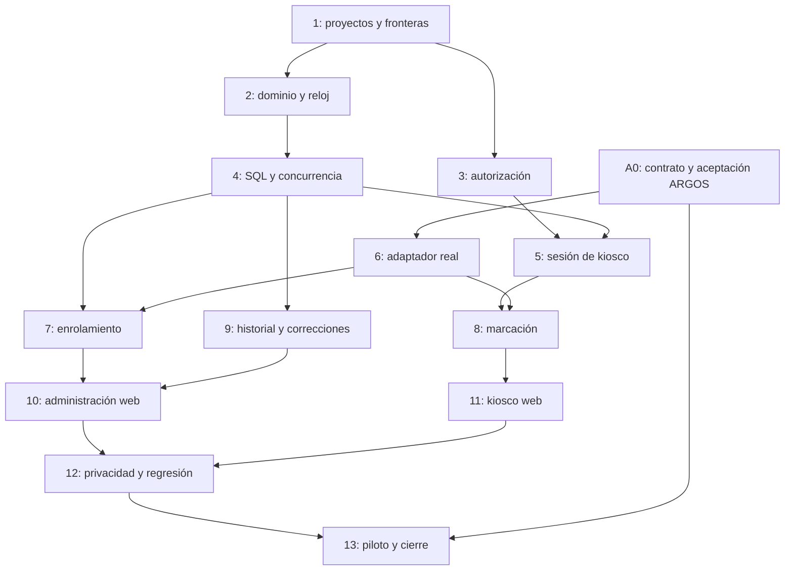

# Control de acceso — plan de la fase 1

Creado: 2026-09-25. Actualizado: 2026-09-29 con decisiones de captura y espera de A0.
Estado: **pendiente de integración externa y piloto**. T1–T5 se entregaron en
los commits `b952b6d` a `f4d139c`; T7–T9 y T12 también están en `f4d139c`; T10
y T11 están en `9a6eea0`. El proveedor actual falla cerrado fuera de pruebas.
Quedan A0/T6 (contrato real de ARGOS y PAD), escenarios dependientes de ese
contrato y T13 (hardware Android, VPS y piloto). Los límites de
despliegue/master/ARGOS/Caserito siguen vigentes.

Leer [brainstorming](../specs/2026-09-25-control-acceso-fase1-brainstorm.md) y
[spec](../specs/2026-09-25-control-acceso-fase1-design.md). Las decisiones
funcionales aprobadas están distinguidas de las propuestas técnicas y de las
dependencias externas pendientes.

Evidencia adicional: [ARGOS compartido con Caserito](../specs/2026-09-26-control-acceso-argos-evaluacion.md).
Custodia confirmada: plantillas cifradas en Trajano-Icarus. ARGOS extrae y
compara por petición, sin perfiles persistentes, base de datos ni caché
biométrica entre peticiones en el nuevo flujo. Las tareas 4, 6 y 7 reflejan esa
decisión. A0 sigue pendiente para PAD, formato y aceptación del contrato.

## Reglas para el futuro ejecutor

- Trabajar en develop según AGENTS.md; preservar cambios ajenos. En el momento
  de escribir existen dos modificaciones ajenas en los tests de observabilidad:
  `CorrelacionExtremoAExtremoTests.cs` y `HostsObservabilidadFixture.cs`.
- Rutas de este plan relativas a Trajano-Icarus salvo A0 (repositorio hermano).
  Leer instrucciones locales antes de modificar cada árbol.
- Cada tarea lleva pruebas dirigidas que deben verse fallar por la causa
  descrita antes de implementar. No marcar una tarea completada por compilar.
- **Antes de cada commit y push de código**, `./verify.ps1` completo, con Docker
  disponible. Los comandos dirigidos siguientes son el ciclo TDD, no sustituyen
  la puerta. No usar excepciones de planes históricos ni `--no-verify`.
- Para commits solo documentales: gates de mojibake, enlaces y diff sin errores.
- .NET 10, versiones centrales de `Icarus/Directory.Packages.props`, EF Core,
  MediatR, xUnit/NSubstitute y Testcontainers existentes. React/MUI/Vitest según
  `web/AGENTS.md`; no introducir otra librería de UI.
- Todos los escenarios usan datos sintéticos. Los ensayos biométricos reales
  del piloto no se almacenan en git ni se vuelcan a logs.
- Cada tarea termina con revisión del diff propio y commit solo de sus rutas.
  Los mensajes previstos abajo son orientativos; nunca incluyen datos privados.

## Dependencias y puntos de decisión


```mermaid
flowchart TD
    A0["A0: contrato y aceptación ARGOS"] --> T6["6: adaptador real"]
    T1["1: proyectos y fronteras"] --> T2["2: dominio y reloj"]
    T1 --> T3["3: autorización"]
    T2 --> T4["4: SQL y concurrencia"]
    T3 --> T5["5: sesión de kiosco"]
    T4 --> T5
    T4 --> T7["7: enrolamiento"]
    T6 --> T7
    T5 --> T8["8: marcación"]
    T6 --> T8
    T4 --> T9["9: historial y correcciones"]
    T7 --> T10["10: administración web"]
    T9 --> T10
    T8 --> T11["11: kiosco web"]
    T10 --> T12["12: privacidad y regresión"]
    T11 --> T12
    T12 --> T13["13: piloto y cierre"]
    A0 --> T13
```

Las tareas 1–5 y 9 no requieren ARGOS real. Tareas 7–8 y UI pueden desarrollarse
contra dobles del contrato una vez fijado A0, pero no completarse como flujo
productivo hasta superar 6 y 13. Si A0 requiere vídeo/gestos en vez de captura
pasiva, actualizar spec y tareas 6, 7 y 11 antes de implementar esas partes.
No seleccionar en silencio un modelo, licencia, umbral o mecanismo de claves.
El custodio ya está elegido: Trajano-Icarus, sin fotos originales persistidas.

## A0 — Integración con ARGOS como motor sin persistencia

Responsable futuro: ejecutor de ARGOS, coordinado con agenteLocal y agenteVPS.
No se inicia ese trabajo desde esta sesión. ARGOS tiene su propio AGENTS.md:
PR hacia su rama permanente develop, pruebas e imagen Docker antes de integrar,
despliegue de producción únicamente manual y autorizado.

Rutas a revisar allí: `ARGOS/views.py`, `ARGOS/api_client.py`,
`ARGOS/decorators.py`, `ARGOS/logger.py`, `requirements.txt`, `Dockerfile` y
`tests/test_workflows.py`. Proponer `docs/control-acceso-v2.md`,
`ARGOS/control_acceso_v2.py` y `tests/test_control_acceso_v2.py` en su propio
plan, después de fijar PAD y formato; no tratar estas rutas nuevas como código
que ya existe.

- [ ] Partir de las capacidades existentes: verify 1:1, extracción e identify
  con candidatos externos; no diseñar como si no existiera reconocimiento.
  Confirmar imagen/commit desplegado actual: doc 34 acredita batería funcional
  del 2026-08-06, doc 45 calibración KYC y doc 48 solamente relojes.
- [ ] Fijar contrato de capacidades, extracción con resultado solo al backend
  e identificación contra candidatos aportados en la petición. Referencias
  opacas compatibles con GUID y versión/modelo/formato explícitos; sin endpoints
  de perfiles, borrado remoto ni operaciones durables en ARGOS.
- [ ] Probar que el nuevo flujo no consulta ICARUS legacy ni una base de datos
  y no conserva imágenes/plantillas entre peticiones. El backend deriva tenant
  y candidatos; ARGOS devuelve únicamente una referencia del conjunto recibido.
- [ ] Decidir modelo PAD/versión/licencia, formato de evidencia y criterios
  medibles de identificación, ambigüedad, rechazo y rendimiento con el equipo.
  La interacción ya está decidida: PAD pasiva sobre una foto tomada tras botón
  y cuenta visible de 3 segundos, sin gestos. Falta validar que el modelo detecte
  fotos y pantallas en el hardware real; no dar por resuelto PAD por elegir la UI.
- [ ] Medir identificación 1:N con 20 trabajadores activos por cliente y carga
  concurrente de Caserito. Objetivo: respuesta visible dentro de 5 segundos
  desde la foto; tras 10 segundos, estado incierto y consulta de operación.
  Es un objetivo de piloto, no un límite duro de trabajadores ni autorización
  para omitir candidatos. Fijar plazos internos y capacidad con mediciones.
- [ ] Estimar el tiempo de una fila de 20 marcaciones secuenciales en una sola
  tablet, incluyendo confirmación, preparación de cámara, cuenta de 3 segundos,
  respuesta facial y retorno a pantalla lista. No modelar 20 capturas a la vez.
- [ ] Coordinar con tarea 4 formato de plantilla y compatibilidad de modelos.
  La custodia y claves se implementarán solo en Trajano; ARGOS no recibe claves
  SQL/de cifrado ni usa el almacén legacy como dependencia oculta.
- [ ] Prueba roja: contrato v2 ausente, rechazo de GUID/tenant ajeno, falta de
  PAD y filtración de candidatos detectados por tests nuevos.
- [ ] Verificación prevista en ARGOS: `python -m unittest discover -s tests -p 'test_control_acceso_v2.py' -v`,
  `python -m unittest discover -s tests -p 'test_*.py' -v` y
  `docker build -t argos:control-acceso-validacion .`. El runner actual es
  unittest y hoy sus tests solo cubren workflows; añadir cobertura de contrato.
  No dar estos comandos por ejecutados en la revisión documental.
- [ ] Preservar `/api/verify` y sus contratos existentes. Los ensayos de
  respaldo/borrado de plantillas pertenecen a Trajano (tareas 4/7/13).
  Tests de integración no prueban precisión PAD.
- [ ] Reproducir la regresión de Caserito: dos imágenes, códigos 400/422/500 y
  respuesta exitosa con los campos consumidos. No cambiar umbral/detector
  globales ni exigir PAD a la foto de documento por añadir el kiosco.
  Medir carga concurrente KYC+kiosco y planificar la interrupción del servicio
  compartido cuando se autorice despliegue; no desplegar en esta sesión.
- [ ] Entregar contrato firmado por versión y matriz de ensayos, sin biometría
  ni secretos en el repositorio de Trajano-Icarus.

Commit documental de salida previsto aquí: `docs(control-acceso): fija contrato ARGOS v2`.
Hasta ese resultado, el adaptador real está condicionado, no implementable por
suposición.

## 1 — Proyectos, composición y fronteras

Crear los `.csproj` bajo:

- `Icarus/src/ControlAcceso/Icarus.ControlAcceso.Domain/`
- `Icarus/src/ControlAcceso/Icarus.ControlAcceso.Application/`
- `Icarus/src/ControlAcceso/Icarus.ControlAcceso.Infrastructure/`

Modificar `Icarus/Icarus.sln`, `Icarus/src/Host/Icarus.Host/Icarus.Host.csproj`
y los `.csproj` de `Icarus.UnitTests`, `Icarus.IntegrationTests` y
`Icarus.ArchitectureTests`. Extender
`Icarus/tests/Icarus.ArchitectureTests/ReglasDeCapasTests.cs` y
`Icarus/tests/Icarus.ArchitectureTests/ReglasDeModulosTests.cs`.

- [x] Rojo: prueba de cobertura detecta módulo ausente; reglas prohíben
  referencias a Clientes/Identity y EF/HTTP dentro del dominio.
- [x] Crear proyectos, referencias mínimas, registro de ensamblados y unidad
  de trabajo propia; no crear tablas o funcionalidades de fases 2–4.
- [x] Dirigido: `dotnet test Icarus/tests/Icarus.ArchitectureTests/Icarus.ArchitectureTests.csproj`.
- [x] Puerta y commit: `feat(control-acceso): crea fronteras del módulo`.

## 2 — Dominio diario, reloj y revisiones

Crear en `Icarus/src/ControlAcceso/Icarus.ControlAcceso.Domain/`:
`ConfiguracionAccesoTrabajador.cs`, `JornadaAcceso.cs`, `Marcacion.cs`,
`RevisionJornada.cs`, `IntervaloAcceso.cs` y `TipoMarcacion.cs`.
En `Icarus.ControlAcceso.Application/Tiempo/`, crear `IRelojAcceso.cs`;
en `Icarus.ControlAcceso.Infrastructure/Tiempo/`, `RelojBolivia.cs` usando
TimeProvider. Crear pruebas en
`Icarus/tests/Icarus.UnitTests/ControlAcceso/JornadaAccesoTests.cs`,
`CorreccionJornadaTests.cs` y `RelojBoliviaTests.cs`.

- [x] Rojo: Salida inicial aceptada, evento al día equivocado, corrección que
  borra original, intervalo solapado y bloqueo indebido por ayer incompleto.
- [x] Implementar alternancia, estado derivado Abierta/Completa/Incompleta,
  revisión efectiva y originales inmutables. Pasar reloj/instante como entradas
  comprobables; sin `DateTime.Now` en dominio.
- [x] Cubrir pares 08:00–12:00/13:00–17:00, cancelación, medianoche BO,
  revisiones vacías y corrección no futura; sin introducir horarios laborales.
- [x] Dirigido: `dotnet test Icarus/tests/Icarus.UnitTests/Icarus.UnitTests.csproj --filter FullyQualifiedName~ControlAcceso`.
- [x] Puerta y commit: `feat(control-acceso): modela jornadas y correcciones`.

## 3 — Elegibilidad y autorización por módulo

Crear `Icarus/src/Clientes/Icarus.Clientes.Application/Autorizacion/IConsultaElegibilidadControlAcceso.cs`
y su implementación en
`Icarus/src/Clientes/Icarus.Clientes.Infrastructure/Autorizacion/ConsultaElegibilidadControlAcceso.cs`.
Crear `Icarus/src/ControlAcceso/Icarus.ControlAcceso.Application/Autorizacion/IConsultaElegibilidadAcceso.cs`,
`Icarus/src/Host/Icarus.Host/Servicios/ConsultaElegibilidadAcceso.cs` y
`Icarus/src/Host/Icarus.Host/Autorizacion/PoliticasControlAcceso.cs`.
Modificar DI de Clientes y `Icarus/src/Host/Icarus.Host/Program.cs`.
Tests: `Icarus/tests/Icarus.IntegrationTests/ControlAcceso/AutorizacionAccesoTests.cs`.

- [x] Rojo: cliente sin módulo admitido, trabajador con FechaCese admitido,
  tenant recibido en cuerpo aceptado o tenant nulo que ve datos globales.
- [x] Implementar consultas de pertenencia/estado/módulo y adaptador del Host.
  La configuración del trabajador pertenece a ControlAcceso, sin añadir flags
  de administración del módulo a `FuncionalidadesTrabajador`.
- [x] Cubrir ambos tenants, roles de plataforma, cliente suspendido, cese,
  desactivación y revocación del módulo entre dos peticiones.
- [x] Cubrir cliente que solo contrata ControlAcceso: alta común con correo y
  contraseña, sin acceso avícola. Al contratar Gestión Avícola después, misma
  cuenta/trabajador y acceso solo con funcionalidades asignadas. No crear un
  flujo de cuenta opcional ni exigir módulo avícola para el alta.
- [x] Dirigido: `dotnet test Icarus/tests/Icarus.IntegrationTests/Icarus.IntegrationTests.csproj --filter FullyQualifiedName~AutorizacionAccesoTests` → 10/10 verdes.
- [x] Puerta y commit: `feat(control-acceso): aplica elegibilidad por tenant` →
  `./verify.ps1` verde, push a `develop`.

## 4 — Persistencia y concurrencia

Crear en `Icarus.ControlAcceso.Application/Persistencia/`:
`IUnidadTrabajoControlAcceso.cs` e `IRepositorioJornadasAcceso.cs`.
En `Icarus.ControlAcceso.Infrastructure/Persistencia/`: `ControlAccesoDbContext.cs`,
`ConfiguracionJornadaAcceso.cs`, `ConfiguracionMarcacion.cs`,
`ConfiguracionRevisionJornada.cs` y `ConfiguracionAccesoTrabajador.cs`.
Crear `Repositorios/RepositorioJornadasAcceso.cs`, `DependencyInjection.cs` y
`DesignTimeControlAccesoDbContextFactory.cs` en Infrastructure.
Generar `Migrations/*_InicialControlAcceso.cs` (timestamp generado por EF).
Modificar Program para migraciones Dev/Testing según patrón vigente.
Tests: `Icarus/tests/Icarus.IntegrationTests/ControlAcceso/PersistenciaAccesoTests.cs`.

Añadir custodia privada en Infrastructure:
`Persistencia/PlantillaFacialProtegida.cs`, `Persistencia/ConfiguracionPlantillaFacial.cs`
y `Biometria/ProtectorPlantillas.cs`; puerto
`Icarus.ControlAcceso.Application/Biometria/IRepositorioPlantillasFaciales.cs`.
Test nuevo: `Icarus/tests/Icarus.IntegrationTests/ControlAcceso/ProteccionPlantillasTests.cs`.

- [x] Rojo: dos primeras entradas concurrentes generan dos jornadas, acceso
  entre tenants, revisión que sobrescribe original y conflicto no detectado.
- [x] Crear schema, índice cliente/trabajador/fecha, rowversion y restricciones;
  no incluir SQL nominal ni logging de parámetros sensibles.
- [x] Separar origen Kiosco/ManualCliente y hora del evento/instante real de
  creación/autor/motivo. No exigir ni inventar evidencia facial al persistir
  un evento manual; conservar datos originales y referencias, nunca imágenes.
- [x] Rojo de custodia: vector legible en SQL/logs, clave en la BD, intercambio
  de filas entre tenants aceptado o contenido manipulado descifrado como válido.
- [x] Persistir solo plantilla cifrada con integridad y contexto
  tenant/trabajador/versión, metadatos de modelo/formato y versión de clave.
  Usar mecanismos criptográficos mantenidos, no algoritmos propios; documentar
  claves fuera de SQL/git, rotación, restauración y tratamiento de revocaciones
  en respaldos. No cachear vectores descifrados entre peticiones.
- [x] Tests usan SQL Server de Testcontainers y transacciones separadas, no
  EF InMemory, incluyendo rollback y consulta de inactivos con tenant explícito.
- [x] Dirigido: `dotnet test Icarus/tests/Icarus.IntegrationTests/Icarus.IntegrationTests.csproj --filter FullyQualifiedName~PersistenciaAccesoTests`.
- [x] Custodia: `dotnet test Icarus/tests/Icarus.IntegrationTests/Icarus.IntegrationTests.csproj --filter FullyQualifiedName~ProteccionPlantillasTests`.
- [x] Puerta y commit: `feat(control-acceso): persiste jornadas con concurrencia` →
  `./verify.ps1` verde (Architecture 6/6, Unit 566/566, GestorCaisy 227/227,
  Integration 207/207), push a `develop` en `a6febc8`.

## 5 — Sesión restringida y activación

Crear `Icarus.ControlAcceso.Domain/SesionKiosco.cs`,
`Icarus.ControlAcceso.Application/Kiosco/IRepositorioSesionesKiosco.cs`,
`Icarus.ControlAcceso.Infrastructure/Kiosco/AutenticacionKioscoHandler.cs`,
`Icarus.ControlAcceso.Infrastructure/Kiosco/OpcionesKiosco.cs` y
`Icarus.ControlAcceso.Infrastructure/Persistencia/ConfiguracionSesionKiosco.cs`.
Crear `Icarus/src/Host/Icarus.Host/Servicios/ActivacionKioscoServicio.cs` y
`Icarus/src/Host/Icarus.Host/Endpoints/KioscoSesionEndpoints.cs`.
Modificar Program y añadir migración de sesión. No sustituir el esquema Bearer
por defecto ni reutilizar el handler de login que emite tokens administrativos.
Tests: `Icarus/tests/Icarus.IntegrationTests/ControlAcceso/SesionKioscoTests.cs`.

- [x] Rojo: cookie Kiosco accede a administración, se emite JWT al activar,
  segunda sesión no revoca primera, tenant se puede falsificar, Origin hermano
  o mutación sin antiforgery aceptada.
- [x] Implementar activación con credenciales verificadas por Identity,
  cookie host-only, hash persistido, esquema/políticas explícitos, expiración,
  reemplazo transaccional, revocación y salida con reautenticación del cliente.
- [x] Verificar errores homogéneos, limitación de intentos, vencimiento y
  ausencia de refresh administrativo en el origen dedicado.
- [x] Probar recuperación de cookie persistente con sesión vigente después de
  reiniciar navegador/Android, sin nuevo login. Una sesión vencida o revocada
  no se reactiva. El arranque automático del dispositivo se ensaya en tarea 13.
- [x] Dirigido: `dotnet test Icarus/tests/Icarus.IntegrationTests/Icarus.IntegrationTests.csproj --filter FullyQualifiedName~SesionKioscoTests` → 14/14 verdes.
- [x] Puerta y commit: `feat(control-acceso): restringe la sesión de kiosco`.
  Entregado dentro de `f4d139c`; la puerta registrada en esa sesión fue verde
  (Architecture 6/6, Unit 566/566, GestorCaisy 227/227, Integration 221/221).

## 6 — Adaptador y contrato real ARGOS (depende de A0)

Crear `Icarus.ControlAcceso.Application/Biometria/IProveedorIdentidadFacial.cs`,
`ResultadoIdentificacionFacial.cs` y `ResultadoEnrolamiento.cs` en esa carpeta;
`Icarus.ControlAcceso.Infrastructure/Argos/ClienteArgosControlAcceso.cs` y
`OpcionesArgosControlAcceso.cs`. Tests:
`Icarus/tests/Icarus.UnitTests/ControlAcceso/ContratoArgosTests.cs` y
`Icarus/tests/Icarus.IntegrationTests/ControlAcceso/ArgosContratoRealTests.cs`.

- [ ] Rojo: ausencia de PAD/campos, respuesta ambigua, versión incompatible,
  tenant/referencia ajenos o timeout tratados como coincidencia válida.
- [ ] Adaptador HTTP con credencial interna, límites, cancelación y códigos
  genéricos; sin retry automático de captura y sin persistir evidencia.
- [ ] Extracción entrega el vector solo al flujo de cifrado del backend; la
  identificación envía candidatos autorizados descifrados por petición y exige
  referencia/versión del conjunto. Probar formato/modelo incompatible, conjunto
  excesivo sin truncado silencioso y ausencia de consultas o perfiles remotos.
- [ ] Dobles deterministas prueban fallos; test contra servicio efímero con
  contrato A0 prueba integración real y queda separado del ensayo biométrico.
  Sin la imagen A0 no marcar ese test pasado ni poner bypass de producción.
- [ ] Dirigido: `dotnet test Icarus/tests/Icarus.UnitTests/Icarus.UnitTests.csproj --filter FullyQualifiedName~ContratoArgosTests`.
- [ ] Real cuando disponible: `dotnet test Icarus/tests/Icarus.IntegrationTests/Icarus.IntegrationTests.csproj --filter FullyQualifiedName~ArgosContratoRealTests`.
- [ ] Puerta y commit: `feat(control-acceso): integra contrato facial ARGOS v2`.

Parcial ya implementado para desbloquear T7/T8: los puertos de aplicación
(`IProveedorIdentidadFacial`, `ResultadoEnrolamiento`, `ResultadoIdentificacionFacial`),
un proveedor determinista de pruebas y un proveedor por defecto que falla
cerrado. `ContratoArgosTests` → 8/8 verdes. El adaptador HTTP real y
`ArgosContratoRealTests` siguen bloqueados por A0.

## 7 — Habilitación y ciclo de enrolamiento

Crear en `Icarus.ControlAcceso.Application/Trabajadores/`:
`DefinirHabilitacionCommand.cs`, `DefinirHabilitacionHandler.cs`,
`EnrolarTrabajadorCommand.cs`, `EnrolarTrabajadorHandler.cs`,
`RevocarRostroCommand.cs`, `RevocarRostroHandler.cs`,
`IRepositorioAccesoTrabajadores.cs` y validadores correspondientes.
Crear `Icarus.ControlAcceso.Infrastructure/Persistencia/ConfiguracionOperacionEnrolamiento.cs`
y repositorio `Repositorios/RepositorioOperacionesEnrolamiento.cs`, sin imágenes
en operaciones. Añadir migración para estado/resultado local e idempotencia.
No crear un reconciliador de perfiles remotos ni persistencia en ARGOS.
Crear `Icarus/src/Host/Icarus.Host/Endpoints/ControlAccesoTrabajadoresEndpoints.cs`.
Tests: `Icarus/tests/Icarus.IntegrationTests/ControlAcceso/EnrolamientoTests.cs`.

- [x] Rojo: perfil pendiente habilitado, revocación fallida que permite marcar,
  sustitución que activa referencia sin confirmación o imagen guardada en SQL.
- [x] Implementar extracción y PAD fuera de transacción; confirmar plantilla
  cifrada, versión, habilitación y resultado idempotente en una transacción
  local. Sustitución elimina el vector anterior, no cuenta ni historial.
- [x] Revocar de forma local atómica: invalidar versión y eliminar contenido
  cifrado activo, conservando solo auditoría. No esperar a ARGOS ni enviar DELETE
  remoto. Deshabilitar es reversible y conserva la plantilla protegida.
- [x] Enrolamiento confirmado habilita automáticamente; resultado pendiente o
  fallido no habilita. Sustituir rostro conserva cuenta e historial.
- [ ] Probar deshabilitación concurrente para que una respuesta tardía no la
  revierta, pérdida de respuesta tras commit (resultado local recuperable),
  reinicio antes del commit (caduca y requiere otra captura), fallo de cifrado,
  perfil inexistente y revocación concurrente sin resurrección por respuesta
  tardía. No persistir capturas para reintentar ni registrar vectores retornados.
- [x] Dirigido: `dotnet test Icarus/tests/Icarus.IntegrationTests/Icarus.IntegrationTests.csproj --filter FullyQualifiedName~EnrolamientoTests` → 7/7 verdes.
- [x] Puerta y commit: `feat(control-acceso): administra enrolamiento de trabajadores`.
  Entregado dentro de `f4d139c`; la puerta registrada en esa sesión fue verde
  (Architecture 6/6, Unit 574/574, GestorCaisy 227/227, Integration 251/251).

Implementada contra el doble determinista de T6; el adaptador HTTP real y los
casos de concurrencia dependen de A0 y de la tarea 13.

## 8 — Marcación, propuesta de Salida e idempotencia

Crear `Icarus.ControlAcceso.Domain/OperacionMarcacion.cs`,
`Icarus.ControlAcceso.Application/Marcaciones/RegistrarMarcacionCommand.cs`,
`RegistrarMarcacionHandler.cs`, `ConfirmarSalidaCommand.cs`,
`ConfirmarSalidaHandler.cs` e `IRepositorioOperacionesMarcacion.cs` en esa carpeta.
Crear `Icarus.ControlAcceso.Infrastructure/Persistencia/ConfiguracionOperacionMarcacion.cs`
y migración; `Icarus/src/Host/Icarus.Host/Endpoints/KioscoMarcacionesEndpoints.cs`.
Tests: `Icarus/tests/Icarus.IntegrationTests/ControlAcceso/MarcacionesTests.cs`.

- [x] Rojo: duplicación por retry, misma clave cambia de acción, propuesta que
  exige segunda confirmación para registrar Salida.
- [x] Reservar operación, invocar la identificación fuera de transacción,
  revalidar estado y confirmar evento/operación juntos.
- [ ] Probar dos entradas simultáneas, 03:59:59/04:00:00 UTC, ARGOS cruzando
  medianoche, éxito con respuesta perdida, caducidad de propuesta, revocación
  durante ARGOS y consulta de resultado solo desde la sesión autorizada.
- [ ] Probar respuesta del Host después de los 10 segundos visibles: el kiosco
  consulta por la clave original y no crea otra marcación ni muestra rechazo
  definitivo mientras la operación siga incierta.
- [x] Revalidar versión de la plantilla justo antes de confirmar: una respuesta
  basada en plantilla revocada o sustituida no puede crear marcación.
- [x] Dirigido: `dotnet test Icarus/tests/Icarus.IntegrationTests/Icarus.IntegrationTests.csproj --filter FullyQualifiedName~MarcacionesTests` → 8/8 verdes.
- [x] Puerta y commit: `feat(control-acceso): registra marcaciones idempotentes`.
  Entregado dentro de `f4d139c`; la puerta registrada en esa sesión fue verde
  (Architecture 6/6, Unit 574/574, GestorCaisy 227/227, Integration 251/251).

Implementada contra el doble determinista de T6; los escenarios de medianoche,
caducidad y concurrencia con ARGOS real dependen de A0 y de la tarea 13.

## 9 — Historial, registros manuales y ajustes auditados

Crear en `Icarus.ControlAcceso.Application/Jornadas/`:
`ListarJornadasQuery.cs`, `ListarJornadasHandler.cs`, `ObtenerJornadaQuery.cs`,
`ObtenerJornadaHandler.cs`, `CorregirJornadaCommand.cs`,
`CorregirJornadaHandler.cs`, `CorregirJornadaValidator.cs`.
Crear en `Icarus.ControlAcceso.Application/Marcaciones/`:
`RegistrarMarcacionManualCommand.cs`, `RegistrarMarcacionManualHandler.cs` y
`RegistrarMarcacionManualValidator.cs`.
Crear `Icarus/src/Host/Icarus.Host/Endpoints/ControlAccesoJornadasEndpoints.cs`.
Mapear también el endpoint de registro manual, con política de Cliente.
Tests: `Icarus/tests/Icarus.IntegrationTests/ControlAcceso/HistorialCorreccionesTests.cs`
y `Icarus/tests/Icarus.IntegrationTests/ControlAcceso/MarcacionesManualesTests.cs`.

- [x] Rojo: se altera el evento original, se borran revisiones, recurso ajeno
  visible, corrección sobre versión obsoleta aceptada o intervalo futuro válido.
- [x] Reutilizar `Pagina<T>` y `PeticionPaginada`; IDs/nombres para UI solo por
  consultas autorizadas, nunca por logging. Conservar historia de inactivos.
- [x] Probar corrección concurrente con marcación y con otra corrección, anular
  jornada y última entrada abierta. La corrección exige jornada existente; el
  comando manual sí crea una nueva cuando no hay registros previos.
  Una marcación posterior al límite de una revisión sigue visible y participa
  en la secuencia efectiva.
- [x] Rojo del registro manual: exige reconocimiento facial, segunda aprobación
  o jornada previa; permite fecha futura/tenant ajeno/motivo vacío, duplica un
  reintento o confunde hora declarada con hora real de creación.
- [x] Implementar registro manual válido al guardar, actual o pasado, con
  motivo/autor, idempotencia, control de versión y secuencia diaria. No llamar
  a ARGOS para validarlo. Probar fallo de reconocimiento seguido de Entrada y
  Salida manuales, y carrera con kiosco/otra petición manual al crear jornada.
- [x] Dirigido: `dotnet test Icarus/tests/Icarus.IntegrationTests/Icarus.IntegrationTests.csproj --filter FullyQualifiedName~HistorialCorreccionesTests` → 8/8 verdes.
- [x] Dirigido manual: `dotnet test Icarus/tests/Icarus.IntegrationTests/Icarus.IntegrationTests.csproj --filter FullyQualifiedName~MarcacionesManualesTests` → 7/7 verdes.
- [x] Puerta y commit: `feat(control-acceso): registra incidencias manuales e historial`.
  Entregado dentro de `f4d139c`; la puerta registrada en esa sesión fue verde
  (Architecture 6/6, Unit 566/566, GestorCaisy 227/227, Integration 236/236).

## 10 — Administración en la web existente

Crear en `web/src/features/control-acceso/`: `api.ts`,
`TrabajadoresAccesoPage.tsx`, `EnrolamientoDialog.tsx`, `HistorialAccesoPage.tsx`,
`CorreccionJornadaDialog.tsx`, `MarcacionManualDialog.tsx` y `SesionKioscoPanel.tsx`,
con `.test.tsx` asociados.
Modificar `web/src/app/router.tsx`, `web/src/app/paginasDiferidas.tsx` y
`web/src/app/navegacion.tsx`. Revisar `web/src/app/AppLayout.tsx` como consumidor
de navegación. Adaptar `web/src/features/trabajadores/TrabajadoresPage.tsx` y
su test para presentar opciones según los módulos contratados, conservando
correo/contraseña obligatorios. Reutilizar UI de filtros/paginación existente.

- [x] Rojo: menú disponible sin módulo, guardado sin motivo, envío al cancelar,
  captura retenida después de cerrar y corrección 409 que se sobrescribe.
- [x] Integrar listado, captura presencial, estados pendientes y error
  genérico, historial y revisión de correcciones. UI exclusivamente online,
  sin dispatcher/almacén offline y sin persistencia de TanStack Query.
- [x] Probar con cámara simulada (detener pistas al cerrar, sin cámara) y que
  guardar con éxito habilita; sustituir no vuelve a crear trabajador/cuenta.
  El ensayo en dispositivo real sigue pendiente en la tarea 13.
- [ ] Ajustar `EnrolamientoDialog` a «Iniciar captura» y cuenta visible 3–2–1
  iniciada al estar lista la cámara; tomar una sola foto automáticamente,
  permitir repetir ante rechazo y detener pistas al cerrar. Cubrir el flujo
  con prueba de UI. Esta decisión de A0 es posterior a la implementación actual.
- [x] Formulario manual accesible al Cliente incluso con historial vacío:
  Entrada/Salida, trabajador, fecha/hora BO y motivo; confirmación de guardado
  sin segundo aprobador, etiqueta Manual y distinción de fechas en el historial.
- [x] Dirigido desde web: `npm run test -- src/features/control-acceso` → 15/15 verdes.
- [x] Regresión desde web: `npm run test -- src/features/trabajadores/TrabajadoresPage.test.tsx`.
- [x] Integración desde web: `npm run lint` y `npm run build`.
- [x] Adaptar `TrabajadoresPage` para presentar opciones según los módulos
  contratados: sin Gestión Avícola no ofrece funcionalidades avícolas; conserva
  el alta común con correo/contraseña. Prueba dirigida local: 7/7 verde.
- [x] Puerta y commit: `feat(control-acceso): añade administración web`.
  Entregado dentro de `9a6eea0`; la puerta registrada en esa sesión fue verde
  (Frontend lint/build/tests; Architecture 6/6, Unit 574/574,
  GestorCaisy 227/227, Integration 252/252).

Se añadió un endpoint de apoyo de T10 en el backend:
`GET /api/control-acceso/trabajadores/acceso` (configuración de acceso por
trabajador del tenant), con prueba en `EnrolamientoTests`.

## 11 — Entrada web del kiosco y cámara

Crear `web/kiosco.html`, `web/src/kiosco/main.tsx`, `AppKiosco.tsx`,
`ActivacionKioscoPage.tsx`, `MarcacionKioscoPage.tsx`, `apiKiosco.ts`,
`useCapturaFacial.ts` y sus tests en `web/src/kiosco/`.
Modificar `web/vite.config.ts` para salida múltiple y exclusión del shell
kiosco del precache; no desactivar offline de Gestión Avícola.

- [x] Rojo: la entrada del kiosco no inicializa AuthProvider ni service worker,
  no guarda foto ni token, cancelar la confirmación no marca, el resultado no se
  muestra antes de confirmar y un timeout no se trata como fallo definitivo.
- [x] Implementar estados del spec con MUI existente y cámara HTTPS; detener
  pistas, confirmaciones, countdown de propuesta y resultado incierto. Sin cola
  offline.
- [ ] Ajustar `MarcacionKioscoPage` a «Iniciar captura» tras confirmar la
  acción; esperar cámara lista, mostrar 3–2–1 y tomar una sola foto sin segundo
  botón. Tras la foto, objetivo de 5 segundos y estado incierto al llegar a 10
  sin respuesta, seguido de consulta de la misma operación. Cubrir espera por
  permiso, cancelar, ausencia de foto válida y respuesta tardía en UI.
  Esta decisión de A0 es posterior a la implementación actual.
- [x] Resultado exitoso con nombre resuelto por el Host, Entrada/Salida y hora
  BO; limpieza automática y no exponerlo en errores. No se escribe el nombre en
  registro de idempotencia, caché ni diagnósticos.
- [ ] Cubrir múltiples rostros, carga lenta, recarga, tecla atrás y errores de
  sesión. El resultado se limpia al vencer y una cámara denegada no envía
  marcación (prueba dirigida local: 4/4 verde). El ensayo en navegador real
  sigue pendiente (tarea 13).
- [x] Dirigido desde web: `npm run test -- src/kiosco` → 4/4 verdes.
- [x] `npm run build`; el shell `kiosco.html` y su chunk quedan fuera del
  precache (0 referencias en `sw.js`).
- [x] Puerta y commit: `feat(control-acceso): añade kiosco web aislado`.
  Entregado dentro de `9a6eea0`; la puerta registrada en esa sesión fue verde
  (Frontend 324/324; Architecture 6/6, Unit 574/574, GestorCaisy 227/227,
  Integration 252/252).

## 12 — Privacidad, regresión y configuración segura

Crear `Icarus/tests/Icarus.IntegrationTests/ControlAcceso/PrivacidadAccesoTests.cs`
y `web/src/kiosco/privacidadKiosco.test.tsx`. Revisar integración con
`Icarus/src/BuildingBlocks/Icarus.BuildingBlocks.Observability/RegistroVueloBehavior.cs`,
`ExceptionHandlingMiddleware.cs`, transporte `web/src/lib/http.ts` y
`web/src/lib/sesionDiagnostico.ts`; modificar solo si un test demuestra fuga.
Crear `docs/operacion/control-acceso-kiosco.md` como contrato de despliegue.

- [x] Rojo: centinelas sintéticos de imagen/ID/hora/motivo aparecen en logs,
  diagnóstico frontend, excepción HTTP, URL nominal o registro de EF.
- [x] Recorrer enrolamiento, negativo facial, éxito con nombre efímero,
  registro manual y corrección por el pipeline real. No reducir baselines ni
  exclusiones existentes.
- [x] Documentar DNS, origen dedicado, proxy de rutas permitidas, cookies
  host-only, no-store, allowlist de Origin, TLS y autenticación interna ARGOS en
  `docs/operacion/control-acceso-kiosco.md`. Configuración productiva a agenteVPS.
- [x] Verificar regresión de login normal, refresh, roles, Funcionalidades y
  offline avícola (suite de la puerta). No se tocaron las modificaciones ajenas
  de observabilidad.
- [x] Dirigido: `dotnet test Icarus/tests/Icarus.IntegrationTests/Icarus.IntegrationTests.csproj --filter FullyQualifiedName~PrivacidadAccesoTests` → 1/1 verde.
- [x] Desde web: `npm run test -- src/kiosco/privacidadKiosco.test.tsx`.
- [x] Puerta y commit: `test(control-acceso): verifica privacidad y aislamiento`.
  Entregado dentro de `f4d139c`; la puerta registrada en esa sesión fue verde
  (Frontend 325/325; Architecture 6/6, Unit 574/574, GestorCaisy 227/227,
  Integration 253/253).

La caída real de ARGOS por el pipeline queda condicionada a A0; con el doble
determinista sí se cubren el negativo facial y el rechazo.

## 13 — Piloto, operación y cierre (sin despliegue automático)

Modificar `docs/operacion/control-acceso-kiosco.md`, este plan y el spec con los
resultados comprobados. Actualizar `AGENTS.md` únicamente al existir código
real y regenerar adaptadores mediante `node quality/generar-adaptadores.mjs`.

- [ ] Plataforma acordada: Android dedicado. Concretar modelo, cámara, bloqueo
  y arranque automático. Android Enterprise es una opción documentada, no una
  licencia/proveedor adquirido ni una prueba pasada. Windows no es plataforma
  del kiosco en esta fase; el PC sí puede ser equipo del cliente para enrolar.
- [ ] Confirmar con agenteVPS HTTPS/origen/rutas, zonas horarias, restauración
  de sesión y custodia de claves/plantillas de Trajano, límites de proxy y
  ausencia de logs nominales. ARGOS no necesita un volumen biométrico ni SQL.
- [ ] Ensayar cámara y PAD en hardware real, rechazo de fotos/pantallas,
  ambigüedad, luz variable y latencia. Fijar criterios en A0 antes de evaluar;
  dejar resultados agregados sin muestras o identidades en git.
- [ ] Medir en la única tablet la duración real de una fila de hasta 20
  trabajadores, desde el primero hasta que el último pueda terminar, con la
  interacción humana y el retorno a pantalla lista incluidos.
- [ ] Ensayar varios pares, olvido, cambio de día, corrección, red cortada tras
  confirmar, reinicio que abre el kiosco sin login con sesión vigente,
  revocación y expiración. Ensayar el flujo manual retroactivo sin aprobación y
  la limpieza del nombre tras mostrar éxito. Usar entorno de prueba para
  mover el reloj lógico, nunca cambiar el reloj del host productivo.
- [ ] Ejecutar `./verify.ps1` y registrar resultado real. Ningún simulador
  justifica marcar la aceptación facial de producción como completada.
- [ ] Actualizar estado de tareas y pendientes. Solo entonces proponer la
  puesta en producción; master/despliegue requieren pedido explícito.
- [ ] Commit previsto: `docs(control-acceso): cierra validación de la fase 1`.

## Verificación de esta entrega documental

Ejecutar sobre los documentos preparados en git:

```powershell
node quality/check-mojibake.mjs
node quality/check-enlaces.mjs
git diff --cached --check
```

No correr build, tests de dominio, cámaras, Docker ni migraciones como si esta
sesión hubiera implementado el módulo. Los comandos anteriores de cada tarea
son instrucciones futuras. La entrega documental puede cerrarse manteniendo
A0, hardware y despliegue como dependencias explícitas.
